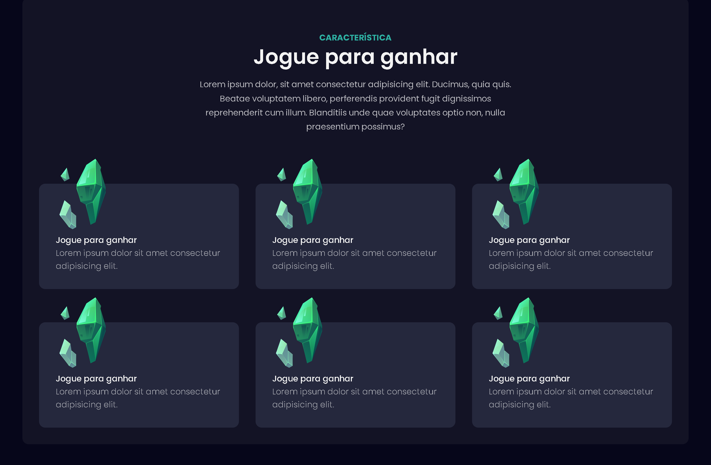
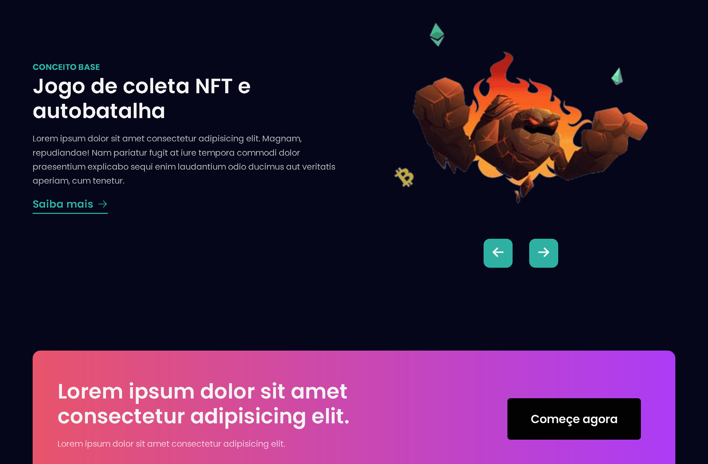
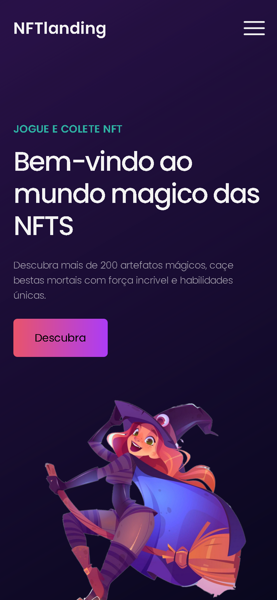
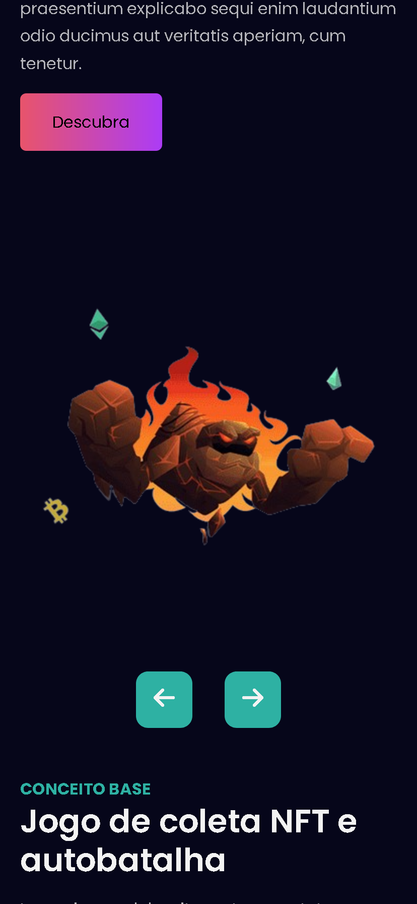

# NFT Landing Page

Uma landing page responsiva sobre NFTs, desenvolvida para praticar Flexbox, semântica de HTML e boas práticas de código.

## 🚀 Funcionalidades

- Design moderno e responsivo
- Layout otimizado para dispositivos móveis
- Uso extensivo do Flexbox para disposição dos elementos
- Seções dedicadas a NFTs, com sliders interativos

## 📱 Layout Responsivo

### Desktop

- **Hero**
  

- **Seções**
  

- **Sliders**
  

### Mobile

- **Hero**
  

- **Seções**
  

- **Sliders**
  

## 🛠️ Tecnologias Utilizadas

- **HTML5** - Estruturação semântica
- **CSS3** (Flexbox) - Layout responsivo e flexível
- **JavaScript** - Interatividade e animações

